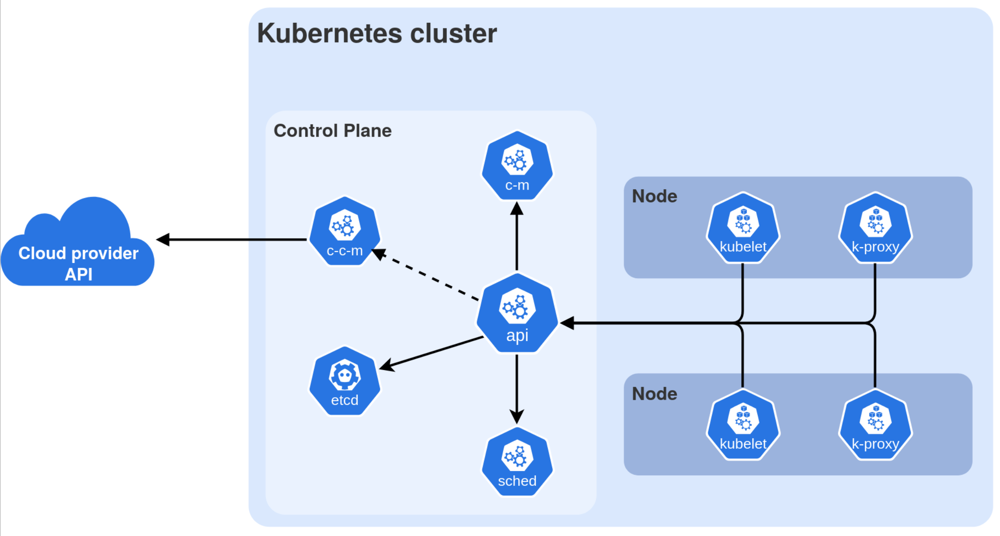

Problem Statement
===

Running a few containers is easy.

Running **production systems** is not.

Problems appear quickly:

- Where should containers run?
- What happens if one crashes?
- How do we scale services?
- How do containers find each other?
- How do we update without downtime?

We need **orchestration**.

---
What is Kubernetes?
===

Kubernetes is a **container orchestration platform**... AND an API!
<!-- column_layout: [2,1] -->
<!-- column: 0 -->
# Orchestration
- Scheduling containers on machines
- Auto-scaling applications
- Load balancing
- Self-healing (restart failed containers)
- Rolling updates & rollbacks
- Service discovery
- Resource management
<!-- column: 1 -->
# API
- Pods
- Deployments
- Services
- ConfigMaps
- Secrets

<!-- reset_layout -->
Goal:

> Run containerized applications **reliably at scale**

---
Kubernetes in one sentence
===

Kubernetes is a system that continuously ensures that the cluster matches the desired state

Example: Your goal is to run three web servers.

Instead of running `podman run nginx` three times, you declare:

- 3 replicas of a web server

Kubernetes ensures:

- 3 are always running

If one dies → a new one is created.

---
Orchestration Advantages
===

<!-- pause -->
<!-- column_layout: [1,1] -->
<!-- column: 0 -->
# Self Healing

Kubernetes constantly monitors pods.

If:

- a container crashes
- a node fails
- a pod becomes unhealthy

Kubernetes automatically:

- restarts containers
- replaces pods
- reschedules workloads

<!-- column: 1 -->
<!-- pause -->
# Rolling Updates

Updating applications without downtime.

Kubernetes will:

1. start new pods
2. wait until healthy
3. terminate old pods

Users experience **no downtime**.

---
Datacenter Abstraction
===

# Benefits
- K8s was invented by Google in 2014
  - Goal: Cloud Platform without Vendor Lock-In
- Abstraction of Hardware/Infrastructure for Devs
  - Multiple Compute Nodes act as a single K8s cluster
  - Compute nodes can be added/removed transparently
    - At scale: Also automatically
<!-- pause -->
## Separation of resources
- Isolation of workloads running on the cluster (containerization)
  - Further separation of privileges: Namespace and RBAC
  - Multi-Tenancy out of the Box!

---
Implementations
===

Kubernetes is open source and like Linux there are various "Distros"/Flavors:
<!-- column_layout: [1,1] -->
<!-- column: 0 -->
# Managed Cloud
- Amazon Elastic Kubernetes Service (EKS)
- Google Kubernetes Engine (GKE)
- Azure Kubernetes Service (AKS)
- IBM Kubernetes Service
- ... and more

# Enterprise Kubernetes
- Red Hat OpenShift
- VMware Tanzu Kubernetes Grid
- Rancher Kubernetes Engine (RKE / RKE2)
- Mirantis Kubernetes Engine
<!-- column: 1 -->
# Lightweight Kubernetes Distros
- k3s by Rancher/SUSE
- MicroK8s by Canonical
- k0s by Mirantis
# Development / Local
- Minikube
- kind (**K**ubernetes **IN** **D**ocker)
- k3d (k3s in Docker)
# Vanilla
- Upstream Kubernetes using `kubeadm`

---
K8s Components
===

> https://kubernetes.io/images/docs/components-of-kubernetes.svg

---
Kubernetes Cluster
===
<!-- column_layout: [1,2] -->
<!-- column: 0 -->
# Summary

A Kubernetes system is called a **cluster**.

It consists of:

- Control Plane
  - API Server
  - Scheduler
  - Controllers

Worker Nodes
- Where containers run

<!-- column: 1 -->
## Control Plane Deployment Options

- **Traditional deployment**:
  - Runs directly on dedicated machines or VMs
  - Often managed as systemd services
- **Static Pods**:
  - Deployed as static Pods, managed by the kubelet
  - Common approach used by tools like kubeadm
- **Self-hosted**:
  - Runs as Pods within the Kubernetes cluster itself
  - Managed by Deployments and StatefulSets
- **Managed Kubernetes services**
  - Cloud providers often abstract away the control plane
  - Managed as part of their service offering

<!-- reset_layout -->

> See https://kubernetes.io/docs/concepts/architecture for more details

---
Control Plane Components
===

Manage the overall state of the cluster:

<!--pause-->
**kube-apiserver**: The core component server that exposes the Kubernetes HTTP API.
<!--pause-->
**etcd**: Consistent and highly-available key value store for all API server data.
<!--pause-->
**kube-scheduler**: Looks for Pods not yet bound to a node, and assigns each Pod to a suitable node.
<!--pause-->
**kube-controller-manager**: Runs controllers to implement Kubernetes API behavior.
<!--pause-->
**cloud-controller-manager** (optional): Integrates with underlying cloud provider(s).

---
Node Components
===

Node components run on every Node, i.e. Control Plane & Worker Nodes

**kubelet**
- Agent that runs on each node in the cluster
- Makes sure that containers are running in a Pod

**kube-proxy (optional)**
- A network proxy implementing part of the Kubernetes Service concept
- Maintains network rules for Pod communication inside or outside of your cluster

**Container Runtime**
- Runtime for OCI Containers ("what Podman/Docker use...")
- Support any runtime implementing the Kubernetes CRI (Container Runtime Interface)
  - e.g. CRI-O and containerd

---
Addons
===

There are various addons using Kubernetes resources to provide cluster-wide features:

## DNS

- In-cluster DNS server like coredns, serves DNS records for Kubernetes services
- Example internal DNS record: `myapp.mynamespace.svc.cluster.local`

## Network plugins
- Software components implementing the container network interface (CNI)
- Responsible for allocating IP addresses
- Also: Network Policies

## and more...

- Web UI (Dashboard), Container resource monitoring, Cluster-level Logging

---
kubectl
===

Kubernetes is managed using `kubectl`. Hint: `alias k=kubectl`

There are additional (more convenient) tools, but this is bread and butter!

Essentially: CRUD CLI utility for the k8s REST API

<!-- pause -->
<!-- column_layout: [5,3] -->
<!-- column: 0 -->
# CRUD Wrappers
| Command              | HTTP Method | CRUD Operation       |
| -------------------- | ----------- | -------------------- |
| `kubectl get`        | GET         | Read                 |
| `kubectl create`     | POST        | Create               |
| `kubectl apply`      | PATCH       | Create/Update        |
| `kubectl replace`    | PUT         | Update               |
| `kubectl patch`      | PATCH       | Update               |
| `kubectl edit`       | PATCH       | Update (interactive) |
| `kubectl delete`     | DELETE      | Delete               |

<!-- column: 1 -->
<!-- pause -->
# Further Actions
| Command      | Action |
|--------------|------|
| logs         | Read pod logs|
| cp           | Copy files |
| config       | Local config |
| describe     | Show details |
| exec         | Exec in container |
| port-forward | Forward port |
| top          | Show resource usage|

---
Kubernetes Ecosystem
===

Kubernetes has a huge ecosystem, regardless of local tools or cluster components

<!-- column_layout: [1,1] -->
<!-- column: 0 -->
# Additional CLI Tools
- kubelogin: Better OIDC
- k9s: Terminal-UI
- stern: Logging made easy
- kubectx: Easy context switching
<!-- column: 1 -->
# Common Cluster Tools
- Helm (package manager)
- Prometheus (monitoring)
- Flux/ArgoCD (GitOps)
- Istio (service mesh)

---
Hands on
===

In this workshop we will cover:

- Kubernetes architecture
- Pods and Deployments
- Services and networking
- Scaling
- Debugging workloads

